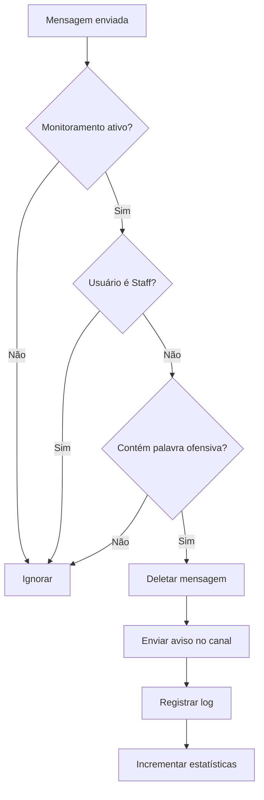

<p align="center">
  
</p>

<p align="center">
  
  
  
  
  
</p>

<br>

<h1 align="center">𝙷𝚘𝚜𝚝𝚅𝚒𝚕𝚕𝚎 • 𝙱𝙾𝚃</h1>

<p align="center">
  Sistema avançado de moderação com detecção automática de palavras ofensivas, monitoramento por servidor e relatórios completos para Discord.
</p>

<p align="center">
  <b>𝙼𝚊𝚍𝚎 𝙱𝚢 𝚈𝟸𝚔_𝙽𝚊𝚝</b>
</p>

---

## ✦ 𝙰𝙱𝙾𝚄𝚃

> O **HostVille Moderação • BOT** é um sistema de moderação moderno criado em **Node.js + discord.js v14**, focado em automação total da moderação e controle de staff.

Ele elimina o trabalho manual e transforma a moderação em algo rápido, organizado e automático, com detecção inteligente de palavras ofensivas.

---

## ✦ 𝙵𝙴𝙰𝚃𝚄𝚁𝙴𝚂

<p align="center"><b>⚡ Sistema completo de moderação ⚡</b></p>

```txt
🛡 AUTO MODERAÇÃO   → Detecção de palavras ofensivas
🗑 DELETE SYSTEM    → Remoção automática de mensagens
📜 LOG SYSTEM       → Registro de todas ações
📩 DM SYSTEM        → Notificações automáticas
👮 STAFF CONTROL    → Usuários staff não são moderados
🎮 CONSOLE MENU     → Controle total via terminal
📊 RELATÓRIOS       → Relatórios diários automáticos
💾 MONITORAMENTO    → Controle por servidor
```

---

✦ 𝙼𝙾𝙳𝙴𝚁𝙰𝚃𝙸𝙾𝙽 𝚂𝚈𝚂𝚃𝙴𝙼

╭─────────────────────────────╮</p>
│  PALAVRA OFENSIVA DETECTADA  │</p>
│  ↓                           │</p>
│  MENSAGEM DELETADA           │</p>
│  ↓                           │</p>
│  AVISO NO CANAL (10s)        │</p>
│  ↓                           │</p>
│  LOG COMPLETO NO CONSOLE     │</p>
╰─────────────────────────────╯</p>

---

✦ 𝙲𝙾𝙼𝙼𝙰𝙽𝙳𝚂

🔹 Comandos de Servidor

Comando Descrição Permissão
/ping Verifica latência do bot Todos
/help Mostra lista de comandos Todos
/adm [code] Painel administrativo Staff
/private [user] [msg] [code] Envia mensagem privada Staff
/report [code] Gera relatório manual Staff

🔹 Comandos de DM

Comando Descrição
!clear Limpa mensagens do bot na DM atual
!clearAll [code] Limpa mensagens de TODAS as DMs
!MonitorOn [code] Ativa monitoramento (todos ou por servidor)
!MonitorOff [code] Desativa monitoramento (todos ou por servidor)

---

✦ 𝙿𝙰𝙻𝙰𝚅𝚁𝙰𝚂 𝙼𝙾𝙽𝙸𝚃𝙾𝚁𝙰𝙳𝙰𝚂

╭────────────────────────────────────╮</p>
│  • 100+ palavras ofensivas         │</p>
│  • Leet speak detection (0→o, 1→i) │</p>
│  • Variações comuns                │</p>
│  • Frases completas                │</p>
│  • Sem falsos positivos            │</p>
╰────────────────────────────────────╯</p>

---

✦ 𝙲𝙾𝙽𝚂𝙾𝙻𝙴 𝙼𝙴𝙽𝚄

---

✦ 𝙵𝙻𝙾𝚆 𝚂𝚈𝚂𝚃𝙴𝙼



---

✦ 𝚂𝚃𝙰𝙵𝙵 𝙲𝙾𝙽𝙵𝙸𝙶


---

✦ 𝙳𝙰𝚃𝙰𝙱𝙰𝚂𝙴

📁 stats (em memória)

· Mensagens deletadas
· Avisos dados
· Membros que entraram/saíram
· Comandos usados
· Uptime do bot

📁 serverMonitoring (Map)

· Status de monitoramento por servidor
· Persistente enquanto bot está online

---

✦ 𝙻𝙾𝙶 𝚂𝚈𝚂𝚃𝙴𝙼

---

✦ 𝙾𝙱𝙹𝙴𝚃𝙸𝚅𝙾

✔ Automação da moderação
✔ Proteção contra palavras ofensivas
✔ Organização da staff
✔ Redução de trabalho manual
✔ Monitoramento flexível por servidor
✔ Relatórios completos e automáticos

---

✦ 𝙳𝙴𝙿𝙴𝙽𝙳𝙴𝙽𝙲𝙸𝙴𝚂

```json
{
  "discord.js": "^14.0.0",
  "dotenv": "^16.0.0",
  "chalk": "^4.1.2"
}
```

---

📌 Status

🟢 Online • ⚡ Estável • 🔒 Seguro • 🛡️ Protegido

---

<p align="center">
  <b>© 2026 HostVille Moderação Bot • 𝙼𝚊𝚍𝚎 𝙱𝚢 𝚈𝟸𝚔_𝙽𝚊𝚝</b>
</p>
